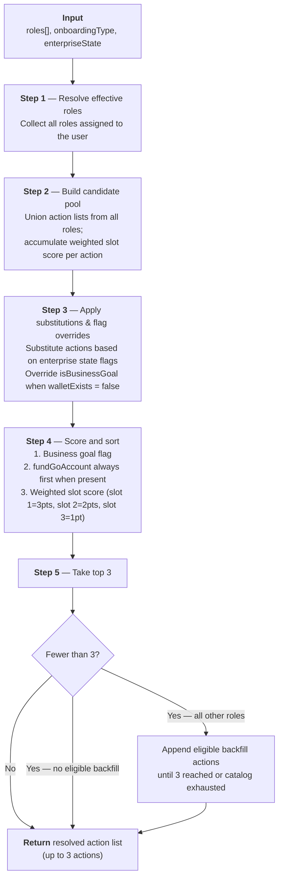

# Get Started Card — Role-Specific Aggregation Logic Spec

**Feature:** Fast Activation · Dashboard · Get Started card  
**Author:** Phyllis Fei  
**Status:** In progress

> **Note:** All pseudocode and code snippets in this document are for reference only — they describe logic and intent, not final implementation. Actual TypeScript implementation may differ.

---

## Overview

The Get Started card surfaces up to 3 role-specific actions on a user's first dashboard visit. The action set is computed from the user's assigned role(s) and enterprise state.

```
if onboardingType = sales-led AND user is super_user:
  → fixed set: fundGoAccount, firstTrade, createWallet

else if onboardingType = organic AND user is super_user:
  → fixed set from section 8
    based on user type (business entity or individual)

else:
  → run aggregation algorithm (steps 1–5)
    (applies to sales-led non-super users; organic non-super users: pending — TBD)
```

### Aggregation algorithm flowchart



---

<details>
<summary><h2>1. Data model</h2></summary>

Defines the algorithm's inputs and surrounding state.

### 1.1 Onboarding type

`onboardingType` is passed into the aggregation function but currently only used for routing — directing to either a fixed action set (super users) or the aggregation algorithm (non-super users). Its role within the algorithm may expand in future.

| Key | Value | Meaning | Consequence |
|---|---|---|---|
| `onboardingType` | `sales-led` | KYB and KYC are completed and approved by the time the user lands on the dashboard. | `goAccountActivated` = `true` |
| `onboardingType` | `organic` | KYB and/or KYC has not been started, but the user is already on the dashboard. | `goAccountActivated` = `false`; flips to `true` once KYB is approved (institutions) or KYC is approved (individuals) |

> **Note:** KYB approval may take time; KYC approval is near-instant.

### 1.2 User roles

`super_user` (aka platform admin) is not a discrete role — it represents a user holding all roles simultaneously, with full platform permissions. The aggregation algorithm does not apply; action sets are fixed per the decision tree in the overview.

```ts
// super_user is not a formal role — a user is treated as super_user when assigned all of the following roles simultaneously
const SUPER_USER: Exclude<UserRole, 'video_id_user'>[] = ['org_admin', 'ent_admin', 'wallet_admin', 'wallet_spender', 'wallet_viewer', 'wallet_trader', 'auditor']
```

| Role ID | Label |
|---|---|
| `super_user` | Super User (Platform Admin) |

A non-super user can hold one or more of the following roles simultaneously:

```ts
type UserRole = 'org_admin' | 'ent_admin' | 'wallet_admin' | 'wallet_spender' | 'wallet_viewer' | 'wallet_trader' | 'video_id_user' | 'auditor'
```

| Role ID | Label |
|---|---|
| `org_admin` | Org Admin |
| `ent_admin` | Enterprise Admin |
| `wallet_admin` | Wallet Admin |
| `wallet_spender` | Wallet Spender |
| `wallet_viewer` | Wallet Viewer |
| `wallet_trader` | Wallet Trader |
| `video_id_user` | Video ID User |
| `auditor` | Auditor |

### 1.3 Enterprise state

Enterprise-level flags consumed in Step 3 to drive substitution rules and scoring overrides.

```ts
type EnterpriseState = {
  bankAccountAdded: boolean
  walletExists: boolean
}
```

| Key | Type | Meaning |
|---|---|---|
| `bankAccountAdded` | boolean | A bank account has been linked to the enterprise |
| `walletExists` (NEED INPUT) | boolean | Whether at least one wallet exists in the enterprise. When `false`, `createWallet` is treated as a business goal in scoring — ensuring it floats to the top and does not become a blocker for roles that need a wallet to perform actions. |

### 1.4 Business goal flag

Defined per action in the action catalog (section 3.1); conditionally overridden at runtime in Step 3.

| Flag | Type | Effect |
|---|---|---|
| `isBusinessGoal` | boolean | When `true`, elevates the action above non-business-goal actions in scoring. |

The following actions are designated as business goals, either statically or conditionally based on enterprise state:

| Action | Type | `isBusinessGoal = true` when |
|---|---|---|
| `fundGoAccount` | Static | Always |
| `firstTrade` | Static | Always |
| `completeVideoID` | Static | Always |
| `createWallet` | Conditional | `walletExists = false` |

### 1.5 Per-user completion state

Per-user rendering state only — not an algorithm input. Completed actions stay visible with a Complete badge; they are never re-filtered. TypeScript type names use "task" to align with the code.

```ts
type UserCompletedTasks = Set<TaskId>
```

</details>

---

<details>
<summary><h2>2. Role action pools (top 3 per role)</h2></summary>

Each role has a fixed ordered list of up to 3 candidate actions. Order within the list signals default priority for that role.

```ts
const ROLE_POOLS: Record<UserRole, TaskId[]> = {
  org_admin:      ['viewMembersRoles', 'understandTasksApprovals', 'viewEnterprisesWallets'],
  ent_admin:      ['createWallet', 'addBankAccount', 'explorePolicies'],
  wallet_admin:   ['fundGoAccount', 'explorePortfolio', 'explorePolicies'],
  wallet_spender: ['fundGoAccount', 'explorePortfolio', 'firstTrade'],
  wallet_viewer:  ['fundGoAccount', 'explorePortfolio', 'viewReports'],
  wallet_trader:  ['firstTrade', 'viewTrades'],
  video_id_user:  ['completeVideoID', 'understandTasksApprovals', 'unlockPolicy'],
  auditor:        ['viewActivityLog'],
}
```

| Role | Slot 1 | Slot 2 | Slot 3 |
|---|---|---|---|
| `super_user` | `fundGoAccount` | `firstTrade` | `createWallet` |
| `org_admin` | `viewMembersRoles` | `understandTasksApprovals` | `viewEnterprisesWallets` |
| `ent_admin` | `createWallet` | `addBankAccount` | `explorePolicies` |
| `wallet_admin` | `fundGoAccount` | `explorePortfolio` | `explorePolicies` |
| `wallet_spender` | `fundGoAccount` | `explorePortfolio` | `firstTrade` |
| `wallet_viewer` | `fundGoAccount` | `explorePortfolio` | `viewReports` |
| `wallet_trader` | `firstTrade` | `viewTrades` | *(only 2 actions — no backfill)* |
| `video_id_user` | `completeVideoID` | `understandTasksApprovals` | `unlockPolicy` |
| `auditor` | `viewActivityLog` | *(only 1 action — no backfill)* | |

> **Note:** The `super_user` row is reference only — not processed by the aggregation algorithm. Super user action sets are handled via the decision tree in the overview.

</details>

---

<details>
<summary><h2>3. Action catalog</h2></summary>

Defines every Get Started action: its metadata, business goal flag, the flow triggered when a user starts it, and any substitution rules. The `Task` type below describes the shape of each entry.

```ts
type Task = {
  id: TaskId                                   // all valid IDs listed in table below
  title: string                                // static copy — never changes
  description: string                          // static copy — never changes
  isBusinessGoal?: boolean                     // floats to top of scoring
  substitution?: {
    whenEnterpriseKey: keyof EnterpriseState   // if this enterprise flag is true...
    replaceWith: TaskId          // ...substitute this action with another
  }
}
```

### 3.1 Full action catalog & flows

| Action ID | Default title | `isBusinessGoal` | Notes | Flow triggered |
|---|---|---|---|---|
| `fundGoAccount` | "Fund Go Account" | `true` | Always active regardless of wallet or bank state. | Deposit flow — bank account context handled internally (see 3.2). |
| `firstTrade` | "Make first trade" | `true` | Dependent on first deposit (and possibly wallet creation). | Highlights the Trade panel on the dashboard.<br><br>If unfunded, an inline nudge prompts deposit first. User selects asset, payment method, enters amount → Review Order. |
| `createWallet` | "Create first wallet" | `true`* | Treated as a business goal (`isBusinessGoal = true`) when `walletExists = false`; standard priority otherwise. | Start wallet creation flow; land on wallet page upon creation.<br><br>Callout flow: Fund your wallet → View wallet members → View policies (if have access). |
| `addBankAccount` | "Add bank account" | `false` | Substitution rule: substituted with `understandTasksApprovals` when `bankAccountAdded = true`. | Bank account setup flow. |
| `explorePolicies` | "Explore policies" | `false` | Backfill eligible (role-restricted). | Land on policy dashboard.<br><br>Callout order: Default policies → Manage policies → Create custom policy. |
| `explorePortfolio` | "Explore portfolio" | `false` | Use Go Account as sample walkthrough whenever possible. | Land on portfolio page.<br><br>Callout order: "What's Go Account" → View Members → View Policies. |
| `viewReports` | "View reports" | `false` | — | Land on report page. |
| `viewTrades` | "View trades" | `false` | — | Land on trade page. |
| `viewMembersRoles` | "View members & roles" | `false` | — | Land on admin console.<br><br>Callout order: View current members → View current roles → Invite new member → Create custom role. |
| `viewEnterprisesWallets` | "View enterprises & wallets" | `false` | — | TBD |
| `understandTasksApprovals` | "Understand tasks & approvals" | `false` | Backfill eligible (role-restricted). | Page routing:<br>`org_admin` → UMS tasks page<br>`ent_admin` / `wallet_admin` / `video_id_user` → enterprise-level tasks page<br>`org_admin` + `ent_admin` → both pages accessible; callout guides to enterprise-level tasks page first, then UMS tasks on the CTA. |
| `completeKYB` | "Complete KYB" | `false` | Organic business entities only. Not included in any role pool — only appears in the super user fixed action sets for organic onboarding (see section 8). | KYB flow. |
| `completeKYC` | "Complete KYC" | `false` | Organic users only (business entities and individuals). Not included in any role pool — only appears in the super user fixed action sets for organic onboarding (see section 8). | KYC flow. |
| `completeVideoID` | "Complete Video ID" | `true` | Always a business goal — completing video verification is the primary purpose of the `video_id_user` role and a prerequisite for everything else. | Start video ID scheduling flow. |
| `unlockPolicy` | "Learn about unlocking policies" | `false` | — | Land on policy page.<br><br>Callout order: Click here to unlock. |
| `viewActivityLog` | "View activity log" | `false` | — | Land on activity log page. |

> \* `createWallet` is `false` by default; overridden to `true` at runtime in Step 3 when `walletExists = false`.

### 3.2 `fundGoAccount` — deposit flow behaviour

The action card title and description are static: always **"Fund Go Account"**. The deposit method available to the user varies by enterprise state, but this is handled inside the deposit flow itself — not on the Get Started card.

| Enterprise state | User role | Deposit flow behaviour |
|---|---|---|
| `bankAccountAdded = false` | • is `super_user`, or<br>• has `ent_admin` + one or multiple of `wallet_admin` / `wallet_spender` / `wallet_viewer` | User can add a bank account from within the deposit flow |
| `bankAccountAdded = true` | • is `super_user`, or<br>• has one or multiple of `wallet_admin` / `wallet_spender` / `wallet_viewer` | User can choose cash or crypto deposit |
| `bankAccountAdded = false` | • has `wallet_admin` / `wallet_spender` / `wallet_viewer` (without `ent_admin`) | User lands on crypto deposit by default; a banner is shown on the cash deposit tab explaining that a bank account has not been set up yet |

### 3.3 Substitution rule — `addBankAccount`

When `bankAccountAdded = true`, the action `addBankAccount` is replaced with `understandTasksApprovals` in the candidate pool before scoring. If `understandTasksApprovals` is already in the pool from another role, `addBankAccount` is simply removed (no duplicate).

</details>

---

<details>
<summary><h2>4. Backfill catalog</h2></summary>

When a user ends up with fewer than 3 actions after scoring (because their role pool is thin), backfill actions are appended in order until 3 actions are reached — subject to role eligibility.

```ts
const BACKFILL_CATALOG: { id: TaskId; eligibleRoles: UserRole[] }[] = [
  { id: 'explorePolicies',          eligibleRoles: ['ent_admin', 'wallet_admin'] },
  { id: 'understandTasksApprovals', eligibleRoles: ['org_admin', 'ent_admin', 'wallet_admin', 'video_id_user'] },
]
```

| Backfill action | Eligible roles |
|---|---|
| `explorePolicies` | `ent_admin`, `wallet_admin` |
| `understandTasksApprovals` | `org_admin`, `ent_admin`, `wallet_admin`, `video_id_user` |

> **Note:** `wallet_trader` and `auditor` intentionally show fewer than 3 actions and are not eligible for any backfill actions.

</details>

---

<details>
<summary><h2>5. Aggregation algorithm</h2></summary>

**This algorithm applies to non-super user accounts only** — whether the user holds a single role or multiple roles. For `super_user` (sales-led and organic), actions are fixed sets defined in the overview decision tree and section 8 — no aggregation or scoring is needed.

> See [Aggregation algorithm flowchart](#aggregation-algorithm-flowchart) in the Overview.

Run this function at render time for all non-super users. Input: `roles[]`, `onboardingType`, `enterpriseState`. Output: ordered array of up to 3 resolved action objects.

### Step 1 — Resolve effective roles

Collect all roles assigned to the user. Super user never reaches this step.

```
effectiveRoles = roles  // super_user is handled separately, not via this algorithm
```

### Step 2 — Build candidate pool

Union the action lists from all effective roles. For each action, accumulate its weighted slot score across all roles it appears in (slot 1 = 3pts, slot 2 = 2pts, slot 3 = 1pt).

```
for each role in effectiveRoles:
  for each (taskId, slotIndex) in ROLE_POOLS[role]:
    pts = 3 - slotIndex  // slot 1=3pts, slot 2=2pts, slot 3=1pt
    if taskId not in pool:
      pool.add({ id: taskId, roles: [role], weightedScore: pts, isBusinessGoal: ACTION_CATALOG[taskId].isBusinessGoal ?? false })
    else:
      pool[taskId].roles.push(role)
      pool[taskId].weightedScore += pts
```

### Step 3 — Apply substitutions and state-based flag overrides

Mutate the pool before filtering or scoring: substitute actions based on enterprise state flags, and override `isBusinessGoal` where conditions apply.

**Substitutions:**
```
// Pass 1 — collect substitutions without mutating the pool
substitutions = []
for each task in pool:
  if task.substitution exists AND enterpriseState[task.substitution.whenEnterpriseKey] === true:
    substitutions.push({ remove: task.id, replaceWith: task.substitution.replaceWith, roles: task.roles, weightedScore: task.weightedScore })

// Pass 2 — apply substitutions
for each s in substitutions:
  remove s.remove from pool
  if s.replaceWith not already in pool:
    pool.add({ id: s.replaceWith, roles: s.roles, weightedScore: s.weightedScore, isBusinessGoal: ACTION_CATALOG[s.replaceWith].isBusinessGoal ?? false })
```

**State-based flag overrides:**
```
// Note: currently hardcoded to createWallet — the only conditional business goal.
// If additional state-based overrides are added in future, generalise this into a loop over ACTION_CATALOG entries.
if enterpriseState.walletExists === false AND pool contains createWallet:
  pool[createWallet].isBusinessGoal = true
```

### Step 4 — Score and sort

Sort the pool using this priority order (highest to lowest):

1. **Business goal flag** — actions marked `isBusinessGoal = true` sort first
2. **`fundGoAccount` anchor** — within the business goal tier, `fundGoAccount` always ranks first when present, regardless of weighted score; it is the most foundational action and a prerequisite for all other business goals
3. **Weighted slot score** — remaining business goal and non-business goal actions sorted by sum of slot points across all roles (slot 1 = 3pts, slot 2 = 2pts, slot 3 = 1pt); higher score sorts higher.

```
pool.sort by:
  1. isBusinessGoal DESC
  2. fundGoAccount always first within business goal tier
  3. weightedScore DESC
```

> ⚠️ **Note:** No tiebreaker is defined for equal-scoring actions — order between ties is arbitrary.

### Step 5 — Take top 3, then backfill

Take the first 3 from the sorted pool. If fewer than 3 remain, iterate through the backfill catalog and append eligible actions (checking role eligibility and that the action isn't already in the top 3) until 3 actions are reached or backfill is exhausted.

```
top3 = pool.slice(0, 3)

if top3.length < 3:
  // No explicit skip needed for wallet_trader or auditor —
  // neither role appears in any backfill action's eligible roles list,
  // so the eligibility check below naturally exhausts without adding anything.
  for each backfillTask in BACKFILL_CATALOG:
    if top3.length >= 3: break
    if backfillTask.id in top3.map(t => t.id): continue
    if user is eligible for backfillTask (per backfill catalog):
      top3.push(backfillTask)
```

Return the resolved action list. Each item includes: `id`, `title`, `description`. All returned actions are active — no block states apply.

</details>

---

<details>
<summary><h2>6. Special cases summary</h2></summary>

| Scenario | Behaviour |
|---|---|
| User is `super_user` | Actions are fixed sets per the overview decision tree. Aggregation algorithm does not run. |
| User has multiple roles | Weighted slot scores accumulate across roles — an action in slot 1 for two roles scores 6pts, outranking an action in slot 3 for three roles (3pts) |
| `bankAccountAdded` becomes `true` | `addBankAccount` is substituted with `understandTasksApprovals` in pool, for ent admins |
| `fundGoAccount`, no bank account, user without `ent_admin` or `super_user` | Action is always active; inside the deposit flow, cash tab shows a banner; crypto deposit is the default |
| `fundGoAccount`, no bank account, user has `ent_admin` or `super_user` | Action is always active; inside the deposit flow, user can add a bank account from within the cash tab |
| `wallet_trader` or `auditor` | No backfill applied; card shows 2 or 1 action respectively |
| All actions completed | All actions are marked as complete; Get Started card becomes dismissable; For You section expands to full set |

> ⚠️ **Open question — `bankAccountAdded` real-time reactivity:** If another user in the same enterprise adds a bank account mid-session, the action set will not update (computed once at load). Is a page refresh acceptable, or is real-time reactivity expected?

</details>

---

<details>
<summary><h2>7. Rendering rules</h2></summary>

- **Active** actions: fully interactive, CTA button shown
- **Completed** actions: the "Start" button is replaced by a "Complete" badge with a checkmark; the action card remains visible in place until the user's next session or until dismissed. When all actions are done, the card title changes to "Setup Complete", a subtitle reads "All essentials are active — your enterprise is ready to go.", and a dismiss (×) button appears in the header.
- Card shows a maximum of 3 actions — the set is computed once at load and does not change during the session; completion state (Active → Complete) updates in place as the user completes actions
- For You section is always visible. Before Get Started is complete, it shows a maximum of 3 cards. Once all Get Started actions are completed (`allDone = true`), the full set is shown. Card ordering inside For You follows the same weighted slot scoring as the aggregation algorithm.

</details>

---

<details>
<summary><h2>8. Sales-led vs. organic signup activation path (super user)</h2></summary>

Institutions onboarded via sales can only land on the dashboard when they've completed KYB and KYC. Their Go Account is already activated. Users who sign up with BitGo themselves (organic) have not yet gone through compliance verification, so their Go Account is not yet activated when they land on the dashboard.

This means the Getting Started card should surface a different set of actions for organic users compared to institutions that were onboarded via sales, where verification is already complete and the Go Account is active from day one.

For organic super users, the card prioritizes guiding them through the verification steps needed to unlock trading before surfacing `firstTrade`. The specific verification required depends on whether the user is signing up as a business entity or an individual.

| User type | `onboardingType` | `goAccountActivated` | KYB | KYC | Action shown in card |
|---|---|---|---|---|---|
| Institutional | `sales-led` | `true` | Required, complete | Required, complete | `fundGoAccount`, `firstTrade`, `createWallet` |
| Institutional | `organic` | `false` | Required, incomplete | Required, incomplete | `completeKYB`, `completeKYC`, `fundGoAccount` |
| Individual | `organic` | `false` | Not required | Required, incomplete | `completeKYC`, `fundGoAccount`, `firstTrade` |

</details>
