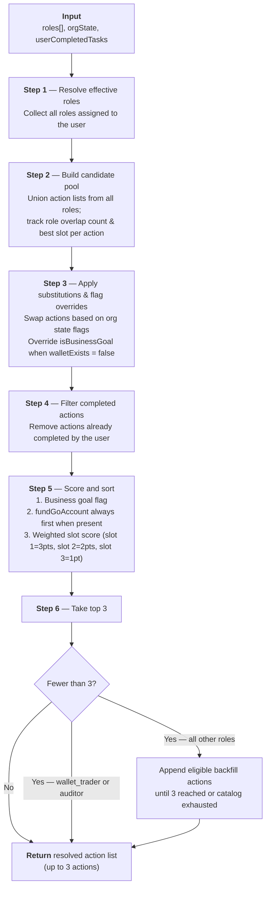

# Get Started card — aggregation logic spec

**Feature:** Fast Activation · Dashboard · Get Started card  
**Author:** Phyllis Fei  
**Status:** In progress

> **Note:** All pseudocode and code snippets in this document are for reference only — they describe logic and intent, not final implementation. Actual TypeScript implementation may differ.

---

## Overview

The Get Started card shows each user up to 3 prioritized actions on their first dashboard visit. Actions are computed at runtime from the user's role(s), the current org state, and which actions they've already completed. The aggregation algorithm runs for non-super users only.

```
if onboardingType = sales-led AND user is super_user:
  → fixed set: fundGoAccount, firstTrade, createWallet

else if onboardingType = organic AND user is super_user:
  → fixed set from section 8
    based on user type (business entity or individual)

else:
  → run aggregation algorithm (steps 1–6)
    (applies to sales-led non-super users; organic non-super users: pending — TBD)
```

---

<details>
<summary><strong>1. Data model</strong></summary>

### 1.1 Org state

| Key | Value | Meaning | `goAccountActivated` state |
|---|---|---|---|
| `onboardingType` | `sales-led` | KYB and KYC are completed (KYB may not be approved yet; KYC approval is near-instant) by the time the user lands on the dashboard. | Always `true` |
| `onboardingType` | `organic` | KYB and/or KYC has not been started, but the user is already on the dashboard. | Starts as `false`; flips to `true` once verification is complete |

### 1.2 User roles

`super_user` is an exclusive role — a user who is `super_user` cannot hold any other role simultaneously. Their action sets are fixed and handled via the decision tree in the overview; the aggregation algorithm does not apply.

| Role ID | Label |
|---|---|
| `super_user` | Super User |

A user can hold one or more of the following roles simultaneously:

| Role ID | Label |
|---|---|
| `org_admin` | Org Admin |
| `ent_admin` | Enterprise Admin |
| `wallet_admin` | Wallet Admin |
| `wallet_spender` | Wallet Spender |
| `wallet_viewer` | Wallet Viewer |
| `wallet_trader` | Wallet Trader |
| `video_id_user` | Video ID User |
| `auditor` | Auditor |

### 1.3 Enterprise state

| Key | Type | Meaning |
|---|---|---|
| `bankAccountAdded` | boolean | A bank account has been linked to the enterprise |
| `goAccountActivated` | boolean | Whether the enterprise's Go Account is currently active. Initial value is determined by `onboardingType` (see 1.1); mutable for organic orgs as verification progresses. For organic individuals, KYC completion flips this to `true`. For organic business entities, KYB completion (NEEDS TO DOUBLE CHECK) flips this to `true`. Do not use as a routing condition — use `onboardingType` instead. |
| `walletExists` (NEED INPUT) | boolean | Whether at least one wallet exists in the enterprise. When `false`, `createWallet` is treated as a business goal in scoring — ensuring it floats to the top and does not become a blocker for roles that need a wallet to perform actions. |

### 1.4 Per-user completion state

A set of task IDs the current user has individually completed. Tracked per user, not per org or enterprise. Note: the TypeScript type names (`TaskId`, `UserCompletedTasks`) use "task" — this aligns with the code, not the product terminology.

```ts
type UserCompletedTasks = Set<TaskId>
```

</details>

---

<details>
<summary><strong>2. Action catalog</strong></summary>

Each action definition has the following shape:

```ts
type Task = {
  id: TaskId
  title: string                                // static copy — never changes
  description: string                          // static copy — never changes
  isBusinessGoal?: boolean                     // floats to top of scoring
  substitution?: {
    whenOrgKey: keyof OrgState   // if this org flag is true...
    replaceWith: TaskId          // ...swap this action out for another
  }
}
```

### 2.1 Full action catalog

| Action ID | Default title | Business goal | Notes | Flow triggered |
|---|---|---|---|---|
| `fundGoAccount` | "Fund Go Account" | Yes | Always active regardless of wallet or bank state. | Deposit flow — bank account context handled internally (see 2.2). |
| `firstTrade` | "Make first trade" | Yes | Dependent on first deposit (and possibly wallet creation). | Highlights the Trade panel on the dashboard.<br><br>If unfunded, an inline nudge prompts deposit first. User selects asset, payment method, enters amount → Review Order. |
| `createWallet` | "Create first wallet" | Conditional | Treated as a business goal (`isBusinessGoal = true`) when `walletExists = false`; standard priority otherwise. | Start wallet creation flow; land on wallet page upon creation.<br><br>Callout flow: Fund your wallet → View wallet members → View policies (if have access). |
| `addBankAccount` | "Add bank account" | — | Substitution rule: swaps to `understandTasksApprovals` when `bankAccountAdded = true`. | Bank account setup flow. |
| `explorePolicies` | "Explore policies" | — | Backfill eligible (role-restricted). | Land on policy dashboard.<br><br>Callout order: Default policies → Manage policies → Create custom policy. |
| `explorePortfolio` | "Explore portfolio" | — | Use Go Account as sample walkthrough whenever possible. | Land on portfolio page.<br><br>Callout order: "What's Go Account" → View Members → View Policies. |
| `viewReports` | "View reports" | — | — | Land on report page. |
| `viewTrades` | "View trades" | — | — | Land on trade page. |
| `viewMembersRoles` | "View members & roles" | — | — | Land on admin console.<br><br>Callout order: View current members → View current roles → Invite new member → Create custom role. |
| `viewEnterprisesWallets` | "View enterprises & wallets" | — | — | TBD |
| `understandTasksApprovals` | "Understand tasks & approvals" | — | Backfill eligible (role-restricted). | Page routing:<br>`org_admin` → UMS tasks page<br>`ent_admin` / `wallet_admin` / `video_id_user` → enterprise-level tasks page<br>`org_admin` + `ent_admin` → both pages accessible; callout guides to enterprise-level tasks page first, then UMS tasks on the CTA. |
| `completeKYB` | "Complete KYB" | — | Organic business entities only. | KYB flow. |
| `completeKYC` | "Complete KYC" | — | Organic users only (business entities and individuals). | KYC flow. |
| `completeVideoID` | "Complete Video ID" | Yes | Always a business goal — completing video verification is the primary purpose of the `video_id_user` role and a prerequisite for everything else. | Start video ID scheduling flow. |
| `unlockPolicy` | "Learn about unlocking policies" | — | — | Land on policy page.<br><br>Callout order: Click here to unlock. |
| `viewActivityLog` | "View activity log" | — | — | Land on activity log page. |

### 2.2 `fundGoAccount` — deposit flow behaviour

The action card title and description are static: always **"Fund Go Account"**. The deposit method available to the user varies by org state, but this is handled inside the deposit flow itself — not on the Get Started card.

| Org state | Deposit flow behaviour |
|---|---|
| `bankAccountAdded = true`, user is `super_user` or has `wallet_admin`, `wallet_spender`, or `wallet_viewer` | User can choose cash or crypto deposit |
| `bankAccountAdded = false`, user is `super_user` or has `ent_admin` | User can add a bank account from within the deposit flow |
| `bankAccountAdded = false`, user has `wallet_admin`, `wallet_spender`, or `wallet_viewer` | User lands on crypto deposit by default; a banner is shown on the cash deposit tab explaining that a bank account has not been set up yet |

### 2.3 Substitution rule — `addBankAccount`

When `bankAccountAdded = true`, the action `addBankAccount` is replaced with `understandTasksApprovals` in the candidate pool before scoring. If `understandTasksApprovals` is already in the pool from another role, `addBankAccount` is simply removed (no duplicate).

</details>

---

<details>
<summary><strong>3. Role action pools (top 3 per role)</strong></summary>

Each role has a fixed ordered list of up to 3 candidate actions. Order within the list signals default priority for that role.

| Role | Slot 1 | Slot 2 | Slot 3 |
|---|---|---|---|
| `super_user` | `fundGoAccount` | `firstTrade` | `createWallet` |
| `org_admin` | `viewMembersRoles` | `understandTasksApprovals` | `viewEnterprisesWallets` |
| `ent_admin` | `createWallet` | `addBankAccount` | `explorePolicies` |
| `wallet_admin` | `fundGoAccount` | `explorePortfolio` | `explorePolicies` |
| `wallet_spender` | `fundGoAccount` | `explorePortfolio` | `firstTrade` |
| `wallet_viewer` | `fundGoAccount` | `explorePortfolio` | `viewReports` |
| `wallet_trader` | `firstTrade` | `viewTrades` | *(only 2 actions — no backfill)* |
| `video_id_user` | `completeVideoID` | `understandTasksApprovals` | `unlockPolicy` |
| `auditor` | `viewActivityLog` | *(only 1 action — no backfill)* | |

> **Note:** The `super_user` row is reference only — not processed by the aggregation algorithm. Super user action sets are handled via the decision tree in the overview.

</details>

---

<details>
<summary><strong>4. Backfill catalog</strong></summary>

When a user ends up with fewer than 3 actions after scoring (because their role pool is thin or actions are completed), backfill actions are appended in order until 3 actions are reached — subject to role eligibility.

| Backfill action | Eligible roles |
|---|---|
| `explorePolicies` | `ent_admin`, `wallet_admin` |
| `understandTasksApprovals` | `org_admin`, `ent_admin`, `wallet_admin`, `video_id_user` |

> **Note:** `wallet_trader` and `auditor` intentionally show fewer than 3 actions and are not eligible for any backfill actions.

</details>

---

<details>
<summary><strong>5. Aggregation algorithm</strong></summary>

**This algorithm applies to non-super user accounts only** — whether the user holds a single role or multiple roles. For `super_user` (sales-led and organic), actions are fixed sets defined in the overview decision tree and section 8 — no aggregation or scoring is needed.

Run this function at render time for all non-super users. Input: `roles[]`, `orgState`, `userCompletedTasks`. Output: ordered array of up to 3 resolved action objects.



### Step 1 — Resolve effective roles

Collect all roles assigned to the user. Super user never reaches this step.

```
effectiveRoles = roles  // super_user is handled separately, not via this algorithm
```

### Step 2 — Build candidate pool

Union the action lists from all effective roles. For each action, accumulate its weighted slot score across all roles it appears in (slot 1 = 3pts, slot 2 = 2pts, slot 3 = 1pt).

```
for each role in effectiveRoles:
  for each (taskId, slotIndex) in R3[role]:
    pts = 3 - slotIndex  // slot 1=3pts, slot 2=2pts, slot 3=1pt
    if taskId not in pool:
      pool.add({ id: taskId, roles: [role], weightedScore: pts })
    else:
      pool[taskId].roles.push(role)
      pool[taskId].weightedScore += pts
```

### Step 3 — Apply substitutions and state-based flag overrides

For each action in the pool, check its substitution rule against current org state. Also apply any state-based flag overrides. Apply before filtering or scoring.

**Substitutions:**
```
for each task in pool:
  if task.substitution exists AND orgState[task.substitution.whenOrgKey] === true:
    replacementId = task.substitution.replaceWith
    if replacementId already in pool:
      remove task from pool  // avoid duplicate
    else:
      replace task with { id: replacementId, roles: task.roles, weightedScore: task.weightedScore }
```

**State-based flag overrides:**
```
if walletExists === false AND pool contains createWallet:
  pool[createWallet].isBusinessGoal = true
```

### Step 4 — Filter completed actions

Remove any action the current user has already completed.

```
pool = pool.filter(task => !userCompletedTasks.has(task.id))
```

### Step 5 — Score and sort

Sort the pool using this priority order (highest to lowest):

1. **Business goal flag** — actions marked `isBusinessGoal = true` sort first
2. **`fundGoAccount` anchor** — within the business goal tier, `fundGoAccount` always ranks first when present, regardless of weighted score; it is the most foundational action and a prerequisite for all other business goals
3. **Weighted slot score** — remaining business goal and non-business goal actions sorted by sum of slot points across all roles (slot 1 = 3pts, slot 2 = 2pts, slot 3 = 1pt); higher score sorts higher

```
pool.sort by:
  1. isBusinessGoal DESC
  2. fundGoAccount always first within business goal tier
  3. weightedScore DESC
```

### Step 6 — Take top 3, then backfill

Take the first 3 from the sorted pool. If fewer than 3 remain, iterate through the backfill catalog and append eligible actions (checking role eligibility and that the action isn't already in the top 3 or completed) until 3 actions are reached or backfill is exhausted.

```
top3 = pool.slice(0, 3)

if top3.length < 3:
  for each backfillTask in BACKFILL_CATALOG:
    if top3.length >= 3: break
    if backfillTask.id in top3: continue
    if userCompletedTasks.has(backfillTask.id): continue
    if user is eligible for backfillTask (per backfill catalog):
      top3.push(backfillTask)
```

Skip backfill entirely for `wallet_trader` and `auditor`.

Return the resolved action list. Each item includes: `id`, `title`, `description`. All returned actions are active — no block states apply.

</details>

---

<details>
<summary><strong>6. Special cases summary</strong></summary>

| Scenario | Behaviour |
|---|---|
| User is `super_user` | Actions are fixed sets per the overview decision tree. Aggregation algorithm does not run. |
| User has multiple roles | Weighted slot scores accumulate across roles — an action in slot 1 for two roles scores 6pts, outranking an action in slot 3 for three roles (3pts) |
| `bankAccountAdded` flips to true | `addBankAccount` is substituted with `understandTasksApprovals` in pool, for ent admins |
| `fundGoAccount`, no bank account, user without `ent_admin` or `super_user` | Action is always active; inside the deposit flow, cash tab shows a banner; crypto deposit is the default |
| `fundGoAccount`, no bank account, user has `ent_admin` or `super_user` | Action is always active; inside the deposit flow, user can add a bank account from within the cash tab |
| `wallet_trader` or `auditor` | No backfill applied; card shows 2 or 1 action respectively |
| All actions completed | All actions are marked as complete; Get Started card becomes dismissable; For You section expands to full set |

</details>

---

<details>
<summary><strong>7. Rendering rules</strong></summary>

- **Active** actions: fully interactive, CTA button shown
- **Completed** actions: the "Start" button is replaced by a "Complete" badge with a checkmark; the action card remains visible in place until the user's next session or until dismissed. When all actions are done, the card title changes to "Setup Complete", a subtitle reads "All essentials are active — your enterprise is ready to go.", and a dismiss (×) button appears in the header.
- Card shows a maximum of 3 actions — the set is computed once at load and does not change during the session; completion state (Active → Complete) updates in place as the user completes actions
- For You section is always visible. Before Get Started is complete, it shows a maximum of 3 cards. Once all Get Started actions are completed (`allDone = true`), the full set is shown. Card ordering inside For You follows the same weighted slot scoring as the aggregation algorithm.

</details>

---

<details>
<summary><strong>8. Sales-led vs. organic signup activation path (super user)</strong></summary>

Institutions onboarded via sales can only land on the dashboard when they've completed KYB and KYC. Their Go Account is already activated. Users who sign up with BitGo themselves (organic) have not yet gone through compliance verification, so their Go Account is not yet activated when they land on the dashboard.

This means the Getting Started card should surface a different set of actions for organic users compared to institutions that were onboarded via sales, where verification is already complete and the Go Account is active from day one.

For organic super users, the card prioritizes guiding them through the verification steps needed to unlock trading before surfacing `firstTrade`. The specific verification required depends on whether the user is signing up as a business entity or an individual.

| User type | `onboardingType` | `goAccountActivated` | KYB | KYC | Action shown in card |
|---|---|---|---|---|---|
| Institutional | `sales-led` | `true` | Required, complete | Required, complete | `fundGoAccount`, `firstTrade`, `createWallet` |
| Institutional | `organic` | `false` | Required, incomplete | Required, incomplete | `completeKYB`, `completeKYC`, `fundGoAccount` |
| Individual | `organic` | `false` | Not required | Required, incomplete | `completeKYC`, `fundGoAccount`, `firstTrade` |

</details>
